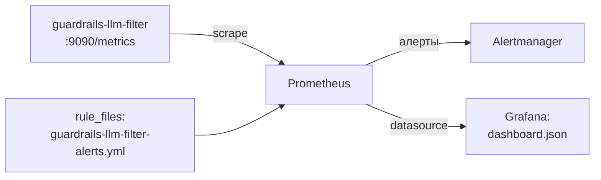
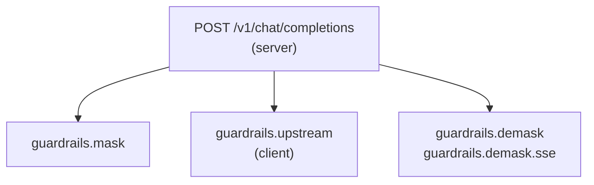

# Мониторинг: Prometheus + Grafana

Пошаговое подключение внешнего мониторинга к `guardrails-llm-filter`.
Справочник всех метрик и алертов — в [docs/operations](../operations/README.md);
живые счётчики без внешнего стека — на странице **Мониторинг** веб-консоли (`:9080`).

Собираемый стек (шаги 1–4 ниже):



## Что отдаёт сервис

| Что | Где |
|---|---|
| Метрики Prometheus | `http://<host>:9090/metrics` (порт — `GUARDRAILS_METRICS_PORT`) |
| Namespace метрик | `extproc_guardrails_` |
| JSON-сводка для консоли | `GET :9080/v1/metrics/summary` |
| Трассы OTLP | экспорт в коллектор, если задан `OTEL_EXPORTER_OTLP_ENDPOINT` (по умолчанию выключено) |

## 1. Подключить Prometheus

Добавьте job в `prometheus.yml`:

```yaml
scrape_configs:
  - job_name: guardrails-llm-filter
    scrape_interval: 15s
    static_configs:
      # GUARDRAILS_METRICS_PORT, по умолчанию 9090
      - targets: ['guardrails-llm-filter:9090']
```

Проверка: `curl -s http://<host>:9090/metrics | grep extproc_guardrails_` должен
вернуть счётчики; в Prometheus UI → Status → Targets job должен быть `UP`.

### Kubernetes

Вариант со scrape-аннотациями на поде:

```yaml
annotations:
  prometheus.io/scrape: 'true'
  prometheus.io/port: '9090'
  prometheus.io/path: /metrics
```

Для prometheus-operator в репозитории есть готовый opt-in kustomize-компонент
(`ServiceMonitor`/`PrometheusRule`): [`deploy/kubernetes/components/monitoring/`](../../deploy/kubernetes/components/monitoring/).

## 2. Подключить алерты

Готовая группа правил — fail-open маскирование, ошибки демаскирования,
недоступность скрейпа: [`deploy/prometheus/guardrails-llm-filter-alerts.yml`](../../deploy/prometheus/guardrails-llm-filter-alerts.yml).

```yaml
# prometheus.yml
rule_files:
  - guardrails-llm-filter-alerts.yml
```

Валидация: `promtool check rules deploy/prometheus/guardrails-llm-filter-alerts.yml`.
Ключевой алерт — `GuardrailsMaskingFailures`: сервис fail-open, при ошибках
маскирования запросы уходят к провайдеру **без обработки**.

## 3. Импортировать дашборд Grafana

Готовый дашборд — [`deploy/grafana/dashboard.json`](../../deploy/grafana/dashboard.json).

1. Connections → Data sources → добавьте ваш Prometheus.
2. Dashboards → New → **Import**.
3. Загрузите `deploy/grafana/dashboard.json` (или вставьте его содержимое).
4. Выберите Prometheus data source → **Import**.

Что внутри (14 панелей в четырёх группах):

- **Traffic & detections** — запросы со срабатываниями по режимам
  (enforce/detect), топ-10 правил, срабатывания по типам данных,
  число различных правил на запрос (p50/p99).
- **Latency** — длительность пайплайна (маска + демаска), p99 сканирования и
  демаскирования, объём просканированного текста.
- **Errors (fail-open events)** — ошибки маскирования/демаскирования и
  отказов стора: всё, что означает «трафик прошёл без защиты».
- **gRPC / service health** — обработанные ext_proc-стримы по кодам,
  доступность scrape-таргетов.

> Дашборд написан под namespace `extproc_guardrails_` и не требует
> дополнительных переменных — только выбранный data source.


## 4. Подключить трассировку (OpenTelemetry)

Метрики отвечают «сколько и как быстро вообще», трасса — «где ушло время
в этом запросе» и «кто его прислал». Data-plane отдаёт спаны по OTLP в любой
коллектор (Tempo, Jaeger, OpenTelemetry Collector), как только задан эндпоинт:

```yaml
environment:
  OTEL_EXPORTER_OTLP_ENDPOINT: http://tempo:4317   # пусто = трассировка выключена
  OTEL_SERVICE_NAME: guardrails-llm-filter
  # OTEL_EXPORTER_OTLP_PROTOCOL: http/protobuf     # если у коллектора только :4318
  # OTEL_TRACES_SAMPLER: parentbased_traceidratio  # доля трасс вместо всех
  # OTEL_TRACES_SAMPLER_ARG: "0.1"
```

Один запрос data-plane — четыре спана:



- `guardrails.mask` — скан и замена значений плейсхолдерами. Атрибут
  `guardrails.outcome` объясняет, почему запрос не был замаскирован:
  `no_findings`, `detect`, `unsupported_schema`, `no_fields`, `error` —
  последние два вместе с красным статусом спана означают проход трафика
  **без обработки** (fail-open), как и алерт `GuardrailsMaskingFailures`.
- `guardrails.upstream` — вызов провайдера; спан закрывается на заголовках
  ответа, поэтому его длительность — время до первого байта, а не длина стрима.
- `guardrails.demask` / `guardrails.demask.sse` — обратная подстановка
  оригиналов; для стрима спан покрывает весь SSE-релей, то есть время, пока
  клиент получал демаскированные токены.

Трасса не рвётся на этом хопе: входящий `traceparent` продолжается, а в запрос
к провайдеру подставляется `traceparent` спана `guardrails.upstream` — спаны
провайдера становятся его детьми, а не соседями.

Полный перечень переменных и правило «в спанах только метаданные, никогда —
содержимое» — в [../configuration/](../configuration/README.md#трассировка-opentelemetry).
